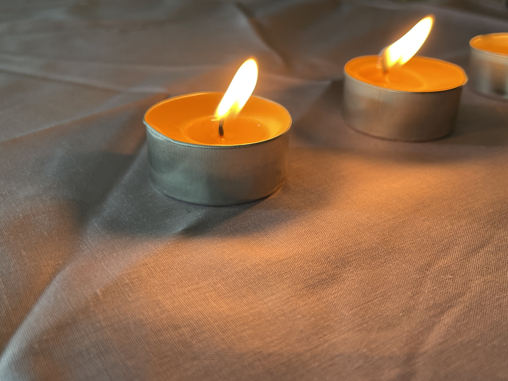

# NeTix
## 예지관 2층 지구과학강의실1

야광봉과 양초를 만들 수 있는 부스!
부스에 들어오시면 간단하게 양초를 만드는 체험을 하고, 야광봉을 만들거나 양초 불 끄기에 도전할 수 있습니다. 야광봉은 한 타임당 선착순 11명만 만들어서 가져갈 수 있습니다. 양초 불 끄기는 1~6 중 한 숫자를 랜덤으로 뽑아서 7개의 초를 한번에 불어 그 숫자 개수의 초를 끄는 것을 성공해야 합니다. 3회 도전하고 실패한다면 줄의 맨 뒤로 이동해 다시 도전해야 합니다. 이렇게 야광봉을 실수 없이 만들거나 양초 불 끄기를 성공한다면 블록을 수령할 수 있습니다.